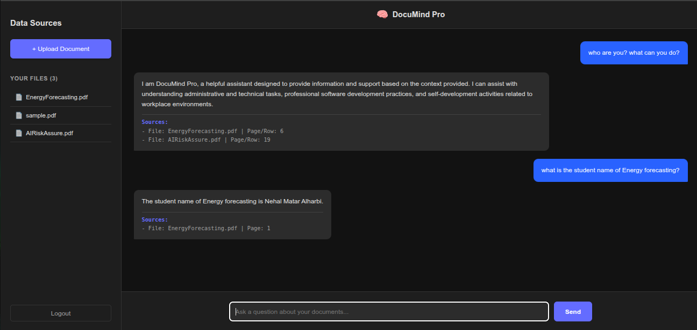

# DocuMind Pro 🧠



**DocuMind Pro** is a professional Retrieval-Augmented Generation (RAG) application that allows users to upload documents (PDF, TXT, CSV) and ask questions about them in natural language. Built with a focus on security, scalability, and a premium user experience.

> **Note**: This is a portfolio project demonstrating full-stack engineering, RAG pipeline implementation, and modern security practices.

## 🚀 Key Features

*   **📄 Universal Ingestion**: Supports PDF, TXT, and CSV/XLSX file parsing.
*   **🔍 RAG Pipeline**: Powered by LangChain and OpenAI for accurate, context-aware answers.
*   **🗄️ Vector Search**: Uses ChromaDB for efficient semantic retrieval.
*   **🔒 Secure Authentication**: JWT-based auth with `bcrypt` password hashing.
*   **🎨 Premium UI**: Responsive, dark-themed interface built with React and Vite.
*   **⚖️ Scalable Architecture**: FastAPI backend with clear separation of concerns.

## 🛠️ Tech Stack

**Backend**
*    **FastAPI**: High-performance web framework.
*    **LangChain**: RAG orchestration.
*    **ChromaDB**: Vector store.
*   **SQLAlchemy**: Database ORM.

**Frontend**
*    **React**: UI library.
*    **Vite**: Next-generation build tool.
*    **CSS3**: Custom premium dark theme.

## 🏁 Getting Started

Follow these instructions to run the project locally.

### Prerequisites
*   Python 3.10+
*   Node.js 16+
*   OpenAI API Key

### 1. Clone the Repository
```bash
git clone https://github.com/your-username/documind-pro.git
cd documind-pro
```

### 2. Backend Setup
```bash
cd backend
python -m venv venv
source venv/bin/activate  # On Windows: venv\Scripts\activate
pip install -r ../requirements.txt

# Create .env file
cp .env.example .env
# Open .env and add your OPENAI_API_KEY
```

### 3. Frontend Setup
```bash
cd ../frontend
npm install
```

### 4. Run the Application
You need to run both the backend and frontend terminals.

**Terminal 1 (Backend):**
```bash
cd backend
source venv/bin/activate
uvicorn app.main:app --reload
```

**Terminal 2 (Frontend):**
```bash
cd frontend
npm run dev
```

Open [http://localhost:5173](http://localhost:5173) in your browser.

## 📚 Architecture

1.  **Upload**: User uploads a file. Backend validates and saves it.
2.  **Ingestion**: File is parsed (using `pdfplumber` or `pandas`), chunked, and embedded using `OpenAIEmbeddings`.
3.  **Storage**: Embeddings are stored in a user-specific ChromaDB collection.
4.  **Retrieval**: When a user asks a question, the system searches ChromaDB for relevant chunks.
5.  **Generation**: The LLM (GPT-4o-mini) generates an answer using the retrieved context.

## 🤝 Contributing

Contributions are welcome! Please see [CONTRIBUTING.md](CONTRIBUTING.md) for details.

## 📄 License

This project is open-source and available under the [MIT License](LICENSE).
